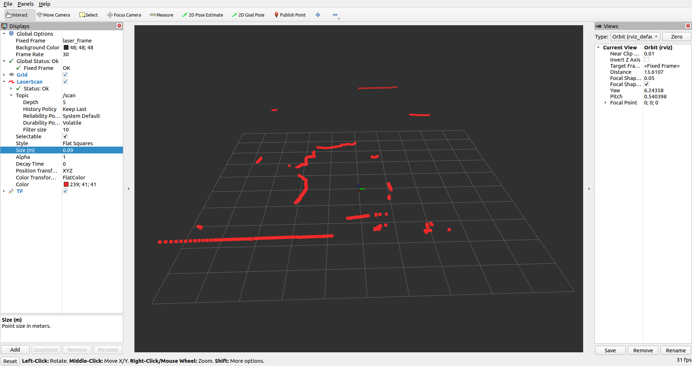

# Purpose of the repository:
While installing ROS2 and working with YDLidar X4 , I faced several problems and issues. This Repo is to help the beginners to get a good understanding of how the things are working and how to setup your first YDLidar project.

# Installations :
### It is assumed that the Following things have been already being installed and updated to the newest version.
+ Ubuntu 22.04.3
+ Python 3.10.12
## Step 1 :
### Install ROS2 Humble :
Head out to [ROS2 Humble Installation Page](https://docs.ros.org/en/humble/Installation/Alternatives/Ubuntu-Development-Setup.html)
and follow the instructions step by step.

Before moving forward for the next step verify that ROS2 is installed correctly and working fine by using the demo node talker and listner. For that you need to :

```
. ~/ros2_humble/install/local_setup.bash
ros2 run demo_nodes_cpp talker
```
Now open another Terminal and run :
```
. ~/ros2_humble/install/local_setup.bash
ros2 run demo_nodes_py listener

```
Now the output should look something like this :


If everything is good, lets move to the next step.

### Optionally you can add the ros2 to your .bashrc file for sourcing ros2 always when a new terminal is launched.

```
echo "source /opt/ros/humble/setup.bash" >> ~/.bashrc

```

## Step 2:

### Install YDLidar SDK :

- Make a Workspace directory:
```
mkdir -p ~/ydlidar_ws/src && cd ~/ydlidar_ws/src
```
- In the workspace directory we need to make install the YDLidar-SDK

```
cd ~/ydlidar_ws
git clone https://github.com/YDLIDAR/YDLidar-SDK.git && cd YDLidar-SDK
```
- Now run the following set of commands :
```
mkdir build
cd build
cmake ..
make
sudo make install
cd ../..
```
- Now the SDK is installed, you can verify it by running the example :

```
cd ~/ydlidar_ws/YDLidar-SDK/build
./tri_test
```
If the above example is working fine and the lidar is getting turned on. You can move to the next step.

## Step 3
### Install Ydlidar Driver:

Now while I was working my project, ydlidar drivers were not available for ROS2 Humble, as humble is a newer vesion. But by researching a bit and going through the issues on the repo, I found a guy who had already faced a similar issue and he solved it by tweaking the code [here](https://github.com/cclngit/ydlidar_ros2_driver).   

For this reason I will be using his version of drivers for making our project.

- Clone the repo in the src directory:

```
cd ~/ydlidar_ws/src
git clone https://github.com/cclngit/ydlidar_ros2_driver.git 
```

- Now lets build the ROS2 packages using [colcon](https://docs.ros.org/en/foxy/Tutorials/Beginner-Client-Libraries/Colcon-Tutorial.html)

```
cd ~/ydlidar_ws
colcon build --symlink-install
```
- The build will take some time the first time and eventully will see that it has completed successfully.

### Optionally you can add the setup.bash to your .bashrc file for sourcing your project always when a new terminal is launched.
```
echo "source ~/ydlidar_ws/install/setup.bash" >> ~/.bashrc

```
### This was the Installation part of using YDLidar with ROS2, now you need to configure and run you first lidar scan.

## Configuring the Lidar parameters
YDLidar has many models and you need to find your parameters according to your model of lidar. You can use [this](https://github.com/YDLIDAR/ydlidar_ros2_driver/blob/master/details.md) sheet to find out the optimal settings and parameters for your lidar. I will be using YDLidar x4. It has the following parameters :
<table>
<tr><th>LIDAR      <th> Model  <th>  Baudrate <th>  SampleRate(K) <th> Range(m)  		<th>  Frequency(HZ) <th> Intenstiy(bit) <th> SingleChannel<th> voltage(V)

<tr><th> X4        <td> 6	   <td>  128000   <td>   5            <td>  0.12~10     	<td> 5~12(PWM)      <td> false          <td> false    	  <td> 4.8~5.2
</table>

As we are using some other version of the drivers we have to change the parameters manually as discussed [here](https://github.com/cclngit/ydlidar_ros2_driver#configure-lidar) according to your lidar model.

### Now you are all set for launching you first lidar visualization in Rviz2

```
ros2 launch ydlidar_ros2_driver ydlidar_launch_view.py 
```

It should look something like :


